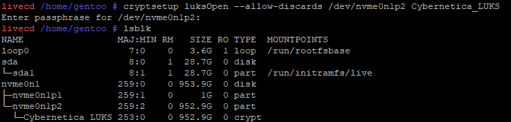
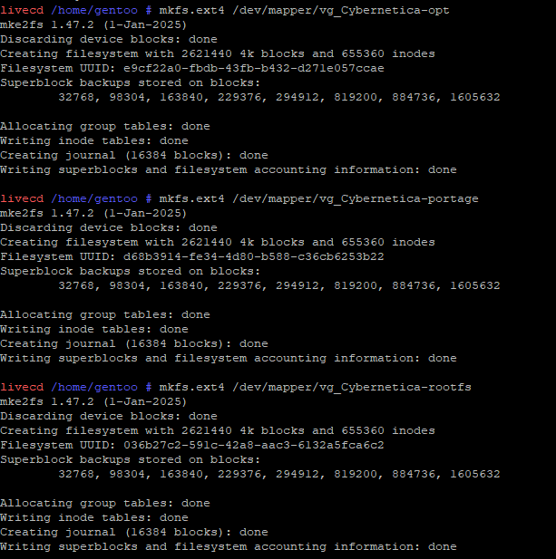
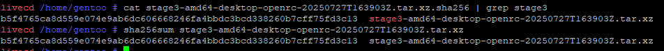
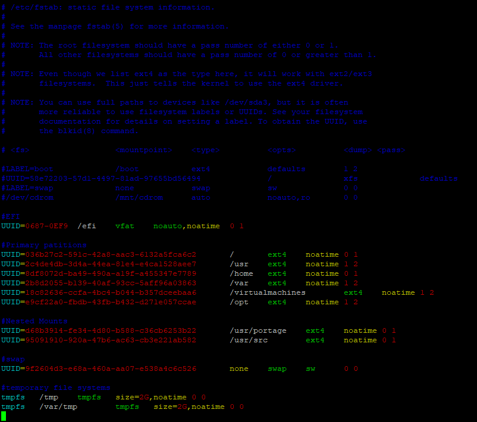
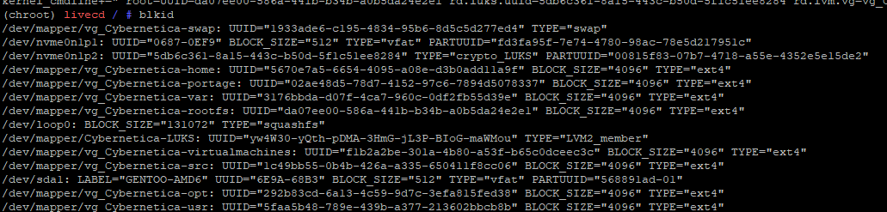

# Gentoo Installation Guide

Full-disk encryption (LUKS1 + LVM) on UEFI/NVMe, using OpenRC and a binary kernel.

> **Last updated:** 2025-07-29

---

## Table of Contents

1. [Partitioning](#step-1-partitioning)
2. [LUKS Encryption](#step-2-luks-encryption)
3. [Open the LUKS Container](#step-3-open-the-luks-container)
4. [LVM Setup](#step-4-lvm-setup)
5. [Format Volumes](#step-5-format-volumes)
6. [Mount Point Setup](#steps-6-10-mount-point-setup)
7. [Sync Time](#step-11-sync-time)
8. [Download Stage3](#step-12-download-stage3)
9. [Verify Hashes](#step-13-verify-hashes)
10. [Unpack Stage3](#step-14-unpack-stage3)
11. [Chroot Prep](#steps-15-18-chroot-prep)
12. [Portage Setup](#steps-19-22-portage-setup)
13. [Base Configuration](#steps-23-25-base-configuration)
14. [Install Packages](#step-26-install-packages)
15. [fstab](#step-27-fstab)
16. [Dracut](#step-28-configure-dracut)
17. [Kernel Config](#step-29-kernel-config)
18. [Install Kernel](#step-30-install-kernel)
19. [GRUB](#steps-31-34-grub)
20. [Finalise](#step-35-set-root-password)
21. [fstab Example](#fstab-example)
22. [References](#references)

---

## Step 0. Preparation

Use nearly any Linux Live ISO to boot the system. The one to select is dependant up on your system. For instance, the Gentoo Live ISO had challenges with an Nvidia RTX 5080. CachyOS was used in that instance as an alternative. There will be a trail and error process once you boot the system to see if it will work.

TIPS: 

1. Once booted, you can turn on SSH and the work on your built remotely from another system.
2. You can use an AI harness (Claude Code and others), give it an SSH key and have it log into the system to assist you. I have not used AI for a full install yet, but it may likely work.

---

## Step 1. Partitioning

Use the lsblk and blkid commands to get a list of disks, make sure you only select the disk you want to install on:
    
<br>
  

Use cfdisk to start your parition process. Make sure to replace the device with the disk you intenad to install Gentoo on, be cautious when working on a multidisk system where other devices have data you wish to retain. 

```bash
cfdisk /dev/nvme2n1
```  
<br>


If prompted, select gpt for the label type:


<br>
  


Set partition 1 type to **EFI System**.


<br>

You should see this now:

<br>

Partition the rest of the disk with type Linux File System (it will be selected automatically and safe to leave it that way), then select write:


<br>


lsblk after cfdisk write:


<br>


blkid after the cfdisk write:


<br>


---

## Step 2. LUKS Encryption

> **Critical:** You must use `--type luks1`. LUKS2 with the argon2id PBKDF is not supported by GRUB and will fail to boot.
>
> After formatting, verify with `cryptsetup luksDump /dev/nvme0n1p2` — if you see `PBKDF: argon2id` the setup will **not** boot.

```bash
 cryptsetup -v \
    --cipher aes-xts-plain64 \
    --key-size 512 \
    --hash sha512 \
    --iter-time 5000 \
    --pbkdf pbkdf2 \
    --type luks1 \
    --use-random \
    --verify-passphrase \
    luksFormat /dev/nvme2n1p2
```

Here is a sample result:


Verify the header:

```bash
cryptsetup luksDump /dev/nvme0n1p2
```


See also:
- https://forums.gentoo.org/viewtopic-t-1171423-start-0.html
- https://forums.gentoo.org/viewtopic-p-8819261.html

---

## Step 3. Open the LUKS Container

> Note: use `_` instead of `-` in the mapper name on future installs to avoid confusion.

```bash
cryptsetup luksOpen --allow-discards /dev/nvme0n1p2 <HOSTNAME>_LUKS
```



confirm the container is up with the command 
```bash
ls -l /dev/mapper/Mindpalace_LUKS
```


---

## Step 4. LVM Setup

Replace <HOSTNAME> with your systems hostname:

```bash
pvcreate /dev/mapper/<HOSTNAME>_LUKS
vgcreate vg_<HOSTNAME> /dev/mapper/<HOSTNAME>_LUKS

lvcreate -L64G   -Cy -n swap            vg_<HOSTNAME>
lvcreate -L10G       -n rootfs           vg_<HOSTNAME>
lvcreate -L40G       -n usr              vg_<HOSTNAME>
lvcreate -L20G       -n var              vg_<HOSTNAME>
lvcreate -L20G       -n opt              vg_<HOSTNAME>
lvcreate -L30G       -n portage          vg_<HOSTNAME>
lvcreate -L10G       -n src              vg_<HOSTNAME>
lvcreate -L200G      -n home             vg_<HOSTNAME>
lvcreate -L600G      -n data             vg_<HOSTNAME>
mkswap /dev/mapper/vg_<HOSTNAME>-swap
mkfs.vfat -F32 /dev/nvme2n1p1

```


---

## Step 5. Format Volumes

Disks can re resized later, that is why we are using LVM. Something to remember ext4 cannot be sized down without shutting the system off and performing the resize unmounted. 
An alternative file system, btrfs, can resize while the disks are running. 

ext4:

```bash
mkfs.ext4 /dev/mapper/vg_<HOSTNAME>-home
mkfs.ext4 /dev/mapper/vg_<HOSTNAME>-opt
mkfs.ext4 /dev/mapper/vg_<HOSTNAME>-portage
mkfs.ext4 /dev/mapper/vg_<HOSTNAME>-rootfs
mkfs.ext4 /dev/mapper/vg_<HOSTNAME>-src
mkfs.ext4 /dev/mapper/vg_<HOSTNAME>-usr
mkfs.ext4 /dev/mapper/vg_<HOSTNAME>-var
mkfs.ext4 /dev/mapper/vg_<HOSTNAME>-data
mkswap    /dev/mapper/vg_<HOSTNAME>-swap
```



---

## Steps 6–10. Mount Point Setup

### Step 6. Create the install root

```bash
mkdir /mnt/install
```

### Step 7. Activate swap

```bash
swapon /dev/mapper/vg_<HOSTNAME>-swap
```

### Step 8. Mount root filesystem

```bash
mount /dev/mapper/vg_<HOSTNAME>-rootfs /mnt/install
```

### Step 9. Create and mount top-level directories + tmpfs

```bash
mkdir /mnt/install/{home,var,data,src,opt,usr,tmp,portage}

mount /dev/mapper/vg_<HOSTNAME>-home            /mnt/install/home
mount /dev/mapper/vg_<HOSTNAME>-var             /mnt/install/var
mount /dev/mapper/vg_<HOSTNAME>-virtualmachines /mnt/install/data
mount /dev/mapper/vg_<HOSTNAME>-opt             /mnt/install/opt
mount /dev/mapper/vg_<HOSTNAME>-usr             /mnt/install/usr
mount /dev/mapper/vg_<HOSTNAME>-portage         /mnt/install/usr/portage
mount /dev/mapper/vg_<HOSTNAME>-src             /mnt/install/usr/src

mkdir /mnt/install/var/tmp
mount -t tmpfs -o size=1G  tmpfs /mnt/install/tmp
mount -t tmpfs -o size=16G tmpfs /mnt/install/var/tmp
```

### Step 10. Mount nested Portage / src volumes

```bash
mkdir /mnt/install/usr/portage
mkdir /mnt/install/usr/src

mount /dev/mapper/vg_Cybernetica-portage /mnt/install/usr/portage
mount /dev/mapper/vg_Cybernetica-src     /mnt/install/usr/src
```

---

## Step 11. Sync Time

```bash
# On the Gentoo live CD:
emaint --auto sync
emerge net-misc/ntp
ntpdate -b -u 0.gentoo.pool.ntp.org

# Verify, then write to hardware clock:
date --utc
hwclock --systohc
```

---

## Step 12. Download Stage3

Use the desktop/OpenRC stage3 tarball. In `links`, press **`d`** to download a file.

```bash
links http://www.gentoo.org/main/en/mirrors.xml
```

---

## Step 13. Verify Hashes

```bash
cat stage3-amd64-desktop-openrc-20250727T163903Z.tar.xz.sha256 | grep stage3
sha256sum stage3-amd64-desktop-openrc-20250727T163903Z.tar.xz
```



---

## Step 14. Unpack Stage3

```bash
cp -a stage3-amd64-desktop-openrc-20260712T170110Z.tar.xz /mnt/install/
[root@CachyOS install]# tar xpvf stage3-amd64-desktop-openrc-20260712T170110Z.tar.xz --xattrs-include='*.*' --numeric-owner

```

---

## Steps 15–18. Chroot Prep

### Step 15. Copy resolv.conf

```bash
cp -L /etc/resolv.conf /mnt/install/etc/
```

### Step 16. Bind-mount kernel pseudo-filesystems

```bash
mount -t proc none       /mnt/install/proc
mount --rbind /sys       /mnt/install/sys
mount --rbind /dev       /mnt/install/dev
```

### Step 17. Mount EFI partition

```bash
mount /dev/nvme0n1p1 /mnt/install/efi
```

### Step 18. Enter the chroot

```bash
chroot /mnt/install /bin/bash
source /etc/profile
export PS1="(chroot) $PS1"
```

---

## Steps 19–22. Portage Setup

### Step 19. Ebuild snapshot

```bash
emerge-webrsync
```

### Step 20. Update the ebuild repository

```bash
emerge --sync
```

### Step 21. Read news

```bash
eselect news list
eselect news read
```

### Step 22. Select profile

```bash
eselect profile list
eselect profile set 7
```


---

## Steps 23–25. Base Configuration

### Step 23. Install vim

```bash
emerge app-editors/vim
```


### Step 24a. Tune make.conf

```bash
# Inspect CPU capabilities
gcc -march=native -E -v - &1 | grep cc1 | tr ' ' '\n' | grep -v mno
lscpu
cat /proc/cpuinfo

# Edit make.conf
vim /etc/portage/make.conf
```

Sample make.conf for skylake CPU:

```
# /etc/portage/make.conf
# <HOSTNAME> — Intel i9-9900K (Skylake-class, 8c/16t), 128 GB RAM, RTX 5080

# ---- Compiler flags: dialed in for THIS CPU (skylake == the 9900K) ----
COMMON_FLAGS="-O2 -pipe -march=skylake -mtune=skylake \
-mmmx -msse -msse2 -msse3 -mssse3 -msse4.1 -msse4.2 -mpopcnt \
-mavx -mavx2 -mfma -mf16c -mbmi -mbmi2 -maes -mpclmul \
-madx -mabm -mlzcnt -mmovbe -mprfchw -mrdrnd -mrdseed \
-mfsgsbase -mfxsr -msahf -mcx16 -mclflushopt -msgx \
-mxsave -mxsavec -mxsaveopt -mxsaves \
--param l1-cache-size=32 --param l1-cache-line-size=64 --param l2-cache-size=16384"
CFLAGS="${COMMON_FLAGS}"
CXXFLAGS="${COMMON_FLAGS}"
FCFLAGS="${COMMON_FLAGS}"
FFLAGS="${COMMON_FLAGS}"
# Shortcut equivalent for a portable guide: COMMON_FLAGS="-march=native -O2 -pipe"

# ---- CPU SIMD feature flags (verify in chroot with: cpuid2cpuflags) ----
CPU_FLAGS_X86="aes avx avx2 f16c fma3 mmx mmxext pclmul popcnt rdrand sse sse2 sse3 sse4_1 sse4_2 ssse3"

# ---- Parallel build tuning (16 threads / 128 GB — core-bound) ----
MAKEOPTS="-j16 -l18"
EMERGE_DEFAULT_OPTS="--jobs=3 --load-average=18 --keep-going --verbose"
FEATURES="candy parallel-fetch"
PORTAGE_NICENESS="5"

# ---- Hardware ----
VIDEO_CARDS="nvidia"        # RTX 5080 (Blackwell) — see driver note below
INPUT_DEVICES="libinput"
GRUB_PLATFORMS="efi-64"

# ---- Licenses (NVIDIA driver is non-free) ----
ACCEPT_LICENSE="*"

# ---- USE (starter set; the desktop/plasma profile provides most — refine to taste) ----
USE="X wayland elogind dbus networkmanager pipewire -systemd"

# ---- Keep build output in English for bug reports ----
LC_MESSAGES=C.UTF-8

# ---- Optional: binary host for the monster packages (rust/llvm/chromium/etc.) ----
# After configuring /etc/portage/binrepos.conf + `getuto`, uncomment:
# FEATURES="${FEATURES} getbinpkg binpkg-request-signature"
# EMERGE_DEFAULT_OPTS="${EMERGE_DEFAULT_OPTS} --getbinpkg"

GENTOO_MIRRORS="https://mirrors.ocf.berkeley.edu/gentoo-distfiles https://distfiles.gentoo.org https://mirrors.rit.edu/gentoo https://gentoo.osuosl.org"


```

### Step 24b. Set timezone

```bash
ls -al /usr/share/zoneinfo/US/Pacific
ln -sf ../usr/share/zoneinfo/US/Pacific /etc/localtime
```

### Step 25. Locales

```bash
# Edit /etc/locale.gen and add:
#   en_US ISO-8859-1
#   en_US.UTF-8 UTF-8

locale-gen
locale -a

eselect locale list
eselect locale set en_US.utf8

env-update && source /etc/profile && export PS1="(chroot) $PS1"
```

---

## Step 26. Install Packages

```bash
emerge \
  net-misc/networkmanager \
  app-admin/doas \
  net-misc/dhcpcd \
  app-admin/syslog-ng \
  app-admin/logrotate \
  sys-process/cronie \
  sys-fs/e2fsprogs \
  sys-fs/dosfstools \
  media-gfx/flameshot \
  net-wireless/iwd \
  net-wireless/iw \
  net-wireless/wpa_supplicant \
  net-misc/netifrc \
  sys-fs/cryptsetup \
  sys-kernel/dracut \
  sys-boot/grub \
  sys-fs/lvm2 \
  app-portage/gentoolkit \
  sys-block/io-scheduler-udev-rules \
  net-misc/chrony \
  app-misc/fastfetch
```

Reference for dracut LVM module issues: https://search.brave.com/search?q=gentoo+dracut+Module+lvm+cannot+be+installed

---

## Step 27. fstab

Generate a draft from `blkid`, then edit manually:

```bash
blkid | while read line; do \
  a=$(echo $line | awk -F ":" '{print $1}'); \
  b=$(echo $line | awk '{print $2}'); \
  echo -e "$b\t$a\text4\tnoatime\t0 1"; \
done
```



See the [fstab example](#fstab-example) below for the final layout.

---

## Step 28. Configure Dracut

Reference: https://wiki.gentoo.org/wiki/Dracut#LVM_on_LUKS

```bash
emerge -av sys-kernel/dracut

# Review UUIDs
blkid
```



Key variables:

| Variable | Value |
|---|---|
| `root` | UUID of the rootfs LVM volume |
| `rd.luks.uuid` | UUID of the LUKS partition |
| `rd.lvm.vg` | Name of the LVM volume group |

Create `/etc/dracut.conf.d/luks.conf`:

```
add_dracutmodules+=" crypt dm rootfs-block lvm  "
kernel_cmdline+=" root=UUID=<rootfs-uuid> rd.luks.uuid=<luks-uuid> rd.lvm.vg=<vg-name> rd.luks.allow-discards "
```

Enable dracut and grub USE flags for the kernel installer:

```bash
echo "sys-kernel/installkernel grub dracut" >> /etc/portage/package.use/installkernel
```

---

## Step 29. Kernel Config

Add to `/usr/src/linux/.config`:

```
CONFIG_CMDLINE_BOOL=y
CONFIG_CMDLINE="dolvm crypt_root=PARTUUID=<luks-partuuid> root=/dev/mapper/vg_Cybernetica-root"
```

Replace `<luks-partuuid>` with the PARTUUID of your LUKS partition (from `blkid`).

---

## Step 30. Install Kernel

```bash
emerge -va gentoo-kernel-bin
```

---

## Steps 31–34. GRUB

### Step 31. Enable crypto support

```bash
echo "GRUB_ENABLE_CRYPTODISK=y" >> /etc/default/grub
```

### Step 32. Install GRUB

```bash
grub-install --efi-directory=/efi
```

### Step 33. Verify crypto flag is set

```bash
grep CRYPTODISK /etc/default/grub
```

### Step 34. Generate GRUB config

```bash
grub-mkconfig -o /efi/grub/grub.cfg
```

---

## Step 35. Set Root Password

```bash
passwd root
```

---

## fstab Example

```
# /etc/fstab

# EFI
UUID=0687-0EF9                                  /efi              vfat    noauto,noatime  0 1

# Root and primary volumes
UUID=036b27c2-591c-42a8-aac3-6132a5fca6c2       /                 ext4    noatime         0 1
UUID=2c4de4db-3d4a-44ea-81e4-e4ca1528aee7       /usr              ext4    noatime         1 2
UUID=8df8072d-ba49-490a-a19f-a455347e7789       /home             ext4    noatime         0 1
UUID=2b8d2055-b139-40af-93cc-5aff96a03863       /var              ext4    noatime         1 2
UUID=18c82636-ccfa-4bc4-b044-b357dceebaa6       /virtualmachines  ext4    noatime         1 2
UUID=e9cf22a0-fbdb-43fb-b432-d271e057ccae       /opt              ext4    noatime         1 2

# Nested mounts
UUID=d68b3914-fe34-4d80-b588-c36cb6253b22       /usr/portage      ext4    noatime         0 1
UUID=95091910-920a-47b6-ac63-cb3e221ab582       /usr/src          ext4    noatime         0 1

# Swap
UUID=9f2604d3-e68a-460a-aa07-e538a4c6c526       none              swap    sw              0 0

# tmpfs
tmpfs   /tmp      tmpfs   size=2G,noatime  0 0
tmpfs   /var/tmp  tmpfs   size=2G,noatime  0 0
```

---

## References

### Official Gentoo Documentation
- [Gentoo Handbook: Disks](https://wiki.gentoo.org/wiki/Handbook:AMD64/Installation/Disks)
- [LVM](https://wiki.gentoo.org/wiki/LVM)
- [Full Disk Encryption From Scratch](https://wiki.gentoo.org/wiki/Full_Disk_Encryption_From_Scratch#fstab_configuration)
- [Rootfs Encryption: LUKS target configuration](https://wiki.gentoo.org/wiki/Rootfs_encryption#LUKS_target_configuration)
- [Dracut: LVM on LUKS](https://wiki.gentoo.org/wiki/Dracut#LVM_on_LUKS)
- [GRUB: Install on encrypted partition](https://wiki.gentoo.org/wiki/GRUB#Install_on_encrypted_partition)
- [Kernel command-line parameters](https://wiki.gentoo.org/wiki/Kernel/Command-line_parameters)

### Gentoo Forums
- [LUKS1 requirement for GRUB](https://forums.gentoo.org/viewtopic-t-1171423-start-0.html)
- [argon2id PBKDF issue](https://forums.gentoo.org/viewtopic-p-8819261.html)
- [Additional boot discussion](https://forums.gentoo.org/viewtopic-p-8843694.html#8843694)
- [Forum thread](https://forums.gentoo.org/viewtopic-t-926264-start-0.html)

### Other
- [gentoo_install reference scripts](https://github.com/sergibarroso/gentoo_install)
- [Blog: Gentoo — the truth behind the myth](https://blog.desdelinux.net/en/gentoo-the-truth-behind-the-myth/)

### Video Guides

[](https://youtu.be/2sOfX_Lb1As?si=gfqbk_odoL9V4MxG)

[](https://www.youtube.com/live/TIua0x1YqU8?si=WZZHvER1MJKbpgGo)

[](https://youtu.be/JjQJwt_z3iY?si=x4VeUdkta513yndB)

[](https://youtu.be/H-57yoB5Rbs?si=56-XRq9F-0k1-yrd)

- https://youtu.be/q9_sXkA4Rv8?si=GVK_StOU41Q_YFrz
